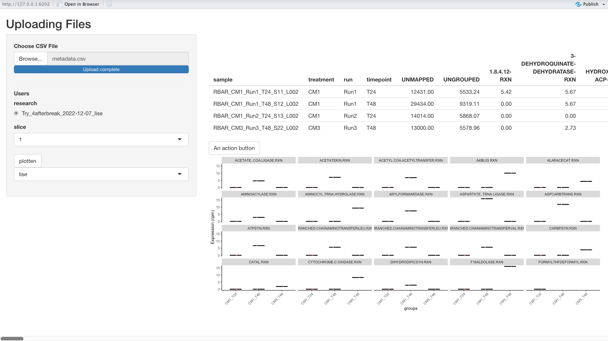

# BakedinBiobakeryShinyDashboard

### About:

This dashboard has the purpose to be a extension on the BakedinBiobakey WUI. This tool is created to facilitate the Biobakery Human3.0 tool (Beghini et al., 2021)[^1]. It takes the output directly out a MySQL based database. These output is can be found trough the side panel the user needs to choice their name and research. If there are results of this research than the Bio-bakery-Maaslin2 tool (Beghini et al., 2021)[^2] can be start. Because the calculations will take a wile a waiting screen will pop-up. After the tool is finished, the user can choice from the slides witch batch of box plots he/she wants to see.

### Setup:

The most important to let this application work is to change the pathway in the file. So scroll trough the app.R file and change the pathways that are relevant for your setup.

Secondly it is important that the login that connects with the database is the same as you have used in the [BakedinBiobakery](https://github.com/GitMasterBart/BakedInBiobakery). 

[^1]: Beghini, F., McIver, L. J., Blanco-Míguez, A., Dubois, L., Asnicar, F., Maharjan, S., Mailyan, A., Manghi, P., Scholz, M., Thomas, A. M., Valles-Colomer, M., Weingart, G., Zhang, Y., Zolfo, M., Huttenhower, C., Franzosa, E. A., & Segata, N. (2021). Integrating taxonomic, functional, and strain-level profiling of diverse microbial communities with biobakery 3. ELife, 10. <https://doi.org/10.7554/eLife.65088>